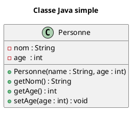
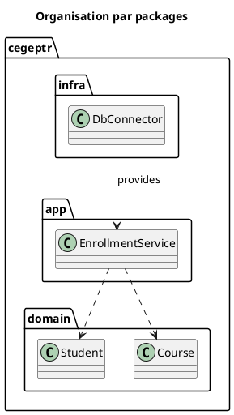
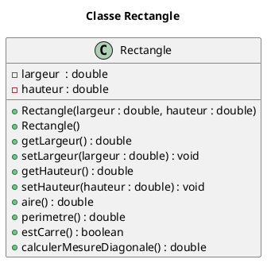

# UML avancé avec extension pour VS Code

## 1. Extension PlantUML

Il existe une extension interactive pour générer facilement des diagrammes UML : [PlantUML](https://marketplace.visualstudio.com/items?itemName=jebbs.plantuml).

Il s'agit ensuite de sauvegarder le modèle UML dans un fichier d'extension `.puml` puis générer l'aperçu interactif en faisant la combinaison de touches `ALT + D`.

### Syntaxe

#### Modificateurs d'accès

Les symboles suivant vont précéder les attributs ou les méthodes d'une classe et possèdent la signification suivante :

|Symbole|Niveau d'accès|
|---|---|
|`-`|`private`|
|`~`|`(default)`|
|`#`|`protected`|
|`+`|`public`|

#### Signature des méthodes

Les signatures de méthodes possèdent la syntaxe suivante:

`symbole nomMethode(param1 : Type, param2 : Type, ...) : TypeRetour`

## 2. Exemples

### 1) Classe simple (attributs et méthodes)



Ce qui est équivalent à la classe suivante :

```java
public class Personne {

    private String nom;
    private int age;

    public Personne(String nom, int age) { /* code du constructeur */ }

    public String getNom() { /* code de l'accesseur */ }

    public int getAge() { /* code de l'accesseur*/ }

    public void setAge(int age) { /* code du mutateur */ }

}
```

### 2) Avec *packages*



## EXERCICE

Faire l'implémentation des classes modélisées ci-dessous :

### 1. Classe `Rectangle`



#### Invariants / règles à respecter (Rectangle)

- `largeur > 0`
- `hauteur > 0`
- Le rectangle par défaut fera `4` de large par `3` de haut.
